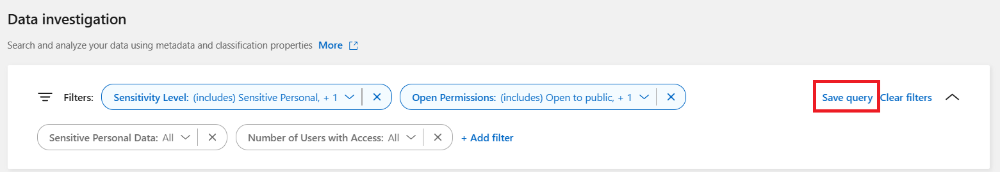
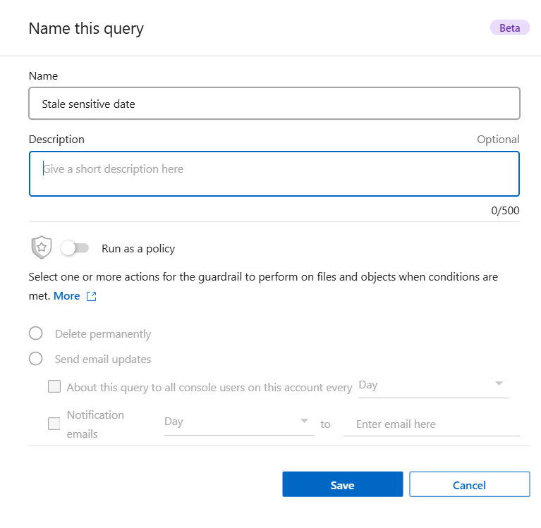

= 
:allow-uri-read: 

.步驟
. 在調查標籤中，透過選擇要使用的篩選器來定義搜尋。看link:task-investigate-data.html["在調查頁面中過濾數據"]了解詳情。
. 一旦您根據自己的喜好設定了所有過濾器特性，請選擇*儲存查詢*。
+

. 為已儲存的查詢命名並新增描述。該名稱必須是唯一的。
. 您可以選擇將查詢儲存為策略：
+
.. 若要將查詢儲存為策略，請切換*作為策略執行*開關。
.. 選擇*永久刪除*或*發送電子郵件更新*。如果您選擇電子郵件更新，您可以每天、每週或每月透過電子郵件將查詢結果傳送給所有控制台使用者。或者，您可以以相同的頻率將通知傳送到特定的電子郵件地址。

. 選擇*儲存*。
+

建立搜尋或策略後，您可以在**已儲存的查詢**標籤中查看它。
